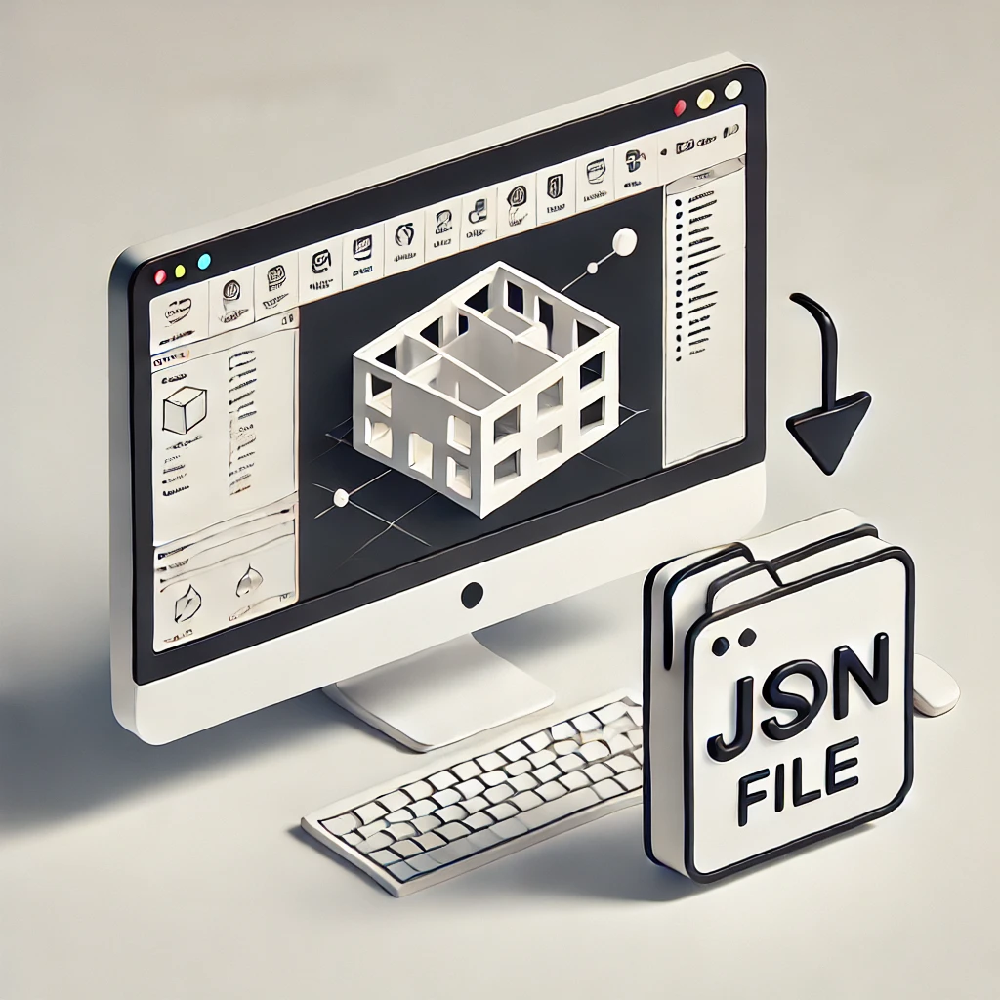
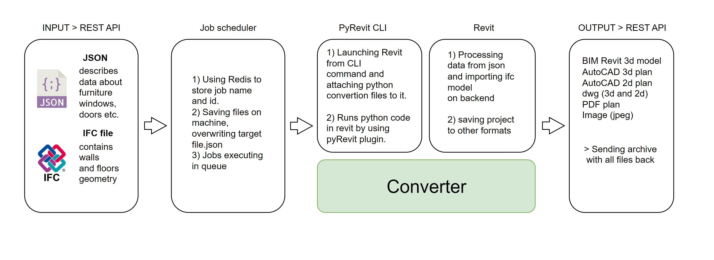
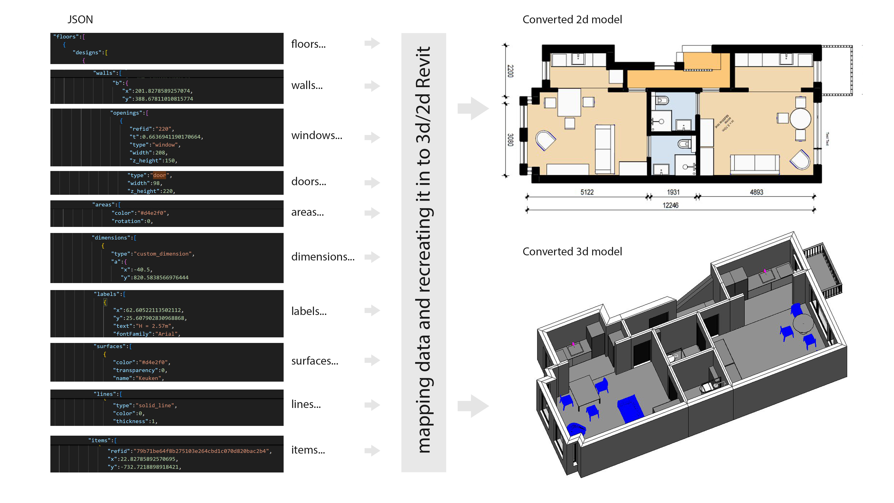

# Revit Automation Plugin (Python, Revit API)

A powerful automation plugin for Autodesk Revit that facilitates the automated creation and customization of 3D and 2D models within the Revit environment. This plugin leverages Python, the Revit API, and C# backend functionality to automate operations, including creating and modifying Revit families based on IFC and JSON model data.



## About Revit and the Revit API

Autodesk Revit is a Building Information Modeling (BIM) software widely used by architects, engineers, and construction professionals to design, document, and visualize building models. The Revit API, primarily based on C#, enables automation and customization of Revit workflows, allowing developers to build plugins that interact with Revit projects, modify parameters, and streamline design tasks.

This is part of system,  utilizes Python for interacting with the Revit API (C#), supported by IronPython, enabling Revit automation with Python scripts. Revit's transactional database requires all model-altering actions to be conducted within a single transaction, making the main script essential for handling the entire automation process.

## How This Plugin Works


The plugin processes IFC (Industry Foundation Classes) and JSON model data, launching Revit and automating various operations, such as:

1. Parsing JSON files to retrieve family parameters and specifications.
2. Creating and modifying Revit families based on the IFC model and JSON data.
3. Adjusting sizes, materials, and properties of Revit models according to project requirements.
4. Generating output in DWG, RVT, IFC, and PDF formats as per user specifications.

The plugin follows an object-oriented structure, with modules handling different tasks and a main execution script (`ifc_fml_to_dwg_rvt_ifc.py`) managing the transaction within Revit. All actions that modify the Revit project must be encapsulated within a single transaction due to Revit's database constraints.
You can check the input and output folders for examples



## Installation
To set up the Revit Automation Plugin, follow these steps:

1. **Install Revit 2024** (compatible with the plugin).
2. **Copy the folder `converter` to `"C:\Program Files\IronPython 3.4\Lib\site-packages"`.**
3. **Install dependencies**:
   - [Python 2.7](https://www.python.org/downloads/release/python-2718/)
   - [IronPython 3.4](https://ironpython.net/)
   - [pyRevit 4.8.13](https://eirannejad.github.io/pyRevit/)
   - [Revit Lookup](https://github.com/jeremytammik/RevitLookup) (latest version)
   - [Revit Python Shell](https://github.com/architecture-building-systems/revitpythonshell)
4. Launch Revit and set the template for IFC opening by using the `revit_template` inside `"TEST_MM_CLIENT_TEMPLE.rte"`.
5. Create an empty Revit file named `revit_init.rvt`.

## Configuration

1. This template comes preloaded with families. For new items from FML, create a new family 
and load it into the Revit template (use `Default_XYZ_box.rfa` from the template).
2. Set the paths to input/output folders in `ifc_fml_to_dwg_rvt_ifc.py`.
3. Specify the path to the Target JSON file that contains the last project name for referencing.

## Usage

To launch the automation process from the command line, use the following command, 
where the first path leads to the main conversion script and the second path to an empty Revit file:

```sh
pyrevit run "~\\ifc_fml_to_dwg_rvt_ifc.py" "~\\init_demo.rvt" --debug
